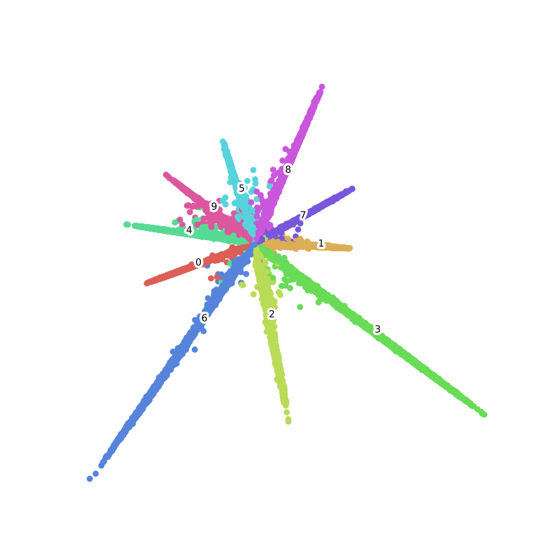

# Gluon FR Toolkit
[](https://gluon-face.readthedocs.io/en/latest/?badge=latest)

GluonFR is a toolkit based on MXnet-Gluon, provides SOTA deep learning algorithm and models in face recognition.

## Installation
GluonFR supports Python 3.5 or later. 
To install this package you need install GluonCV and MXNet first:
```shell
pip install gluoncv --pre
pip install mxnet-mkl --pre --upgrade
# if cuda XX is installed
pip install mxnet-cuXXmkl --pre --upgrade
```
Then install gluonfr:

- From Source(recommend)

```shell
pip install git+https://github.com/THUFutureLab/gluon-face.git@master
```

- Pip

```shell
pip install gluonfr
```

## GluonFR Introduction:
GluonFR is based on MXnet-Gluon, if you are new to it, please check out [dmlc 60-minute crash course](http://gluon-crash-course.mxnet.io/).

#### Data: 
This part provides input pipeline for training and validation, 
all datasets is aligned by mtcnn and cropped to (112, 112) by DeepInsight, 
they converted images to `train.rec`, `train.idx` and `val_data.bin` files,  please check out 
[[insightface/Dataset-Zoo]](https://github.com/deepinsight/insightface/wiki/Dataset-Zoo) for more information. 
In `data/dali_utils.py`, there is a simple example of Nvidia-DALI. It is worth trying when data augmentation with cpu 
can not satisfy the speed of gpu training,  

The files should be prepared like:
```
face/
    emore/
        train.rec
        train.idx
        property
    ms1m/
        train.rec
        train.idx
        property
    lfw.bin
    agedb_30.bin
    ...
    vgg2_fp.bin
```
We use `~/.mxnet/datasets` as default dataset root to match mxnet setting.

#### [Model_Zoo](/wiki/Model_Zoo):
mobile_facenet, res_attention_net, se_resnet... 


#### Loss:
GluonFR provides implement of losses in recent, including SoftmaxCrossEntropyLoss, ArcLoss, TripletLoss, 
RingLoss, CosLoss, L2Softmax, ASoftmax, CenterLoss, ContrastiveLoss, ... , and we will keep updating in future.  
If there is any method we overlooked, please open an [issue](https://github.com/THUFutureLab/gluon-face/issues).

#### Example:

`examples/` shows how to use gluonfr to train a face recognition model, and how to get Mnist 2-D 
feature embedding visualization.  
  
## Losses in GluonFR:  

The last column of this chart is the best LFW accuracy reported in paper, they are trained with different data and networks, 
later we will give our results of these method with same train data and network. 

|Method| Paper |Visualization of MNIST|LFW|
|:---|:---:| :---:|:---:|
|Contrastive Loss|[ContrastiveLoss](http://yann.lecun.com/exdb/publis/pdf/hadsell-chopra-lecun-06.pdf)|-|-|
|Triplet|[1503.03832](https://arxiv.org/abs/1503.03832)|-|99.63±0.09|
|Center Loss|[CenterLoss](https://ydwen.github.io/papers/WenECCV16.pdf)||99.28 |
|L2-Softmax|[1703.09507](https://arxiv.org/abs/1703.09507)|-|99.33|
|A-Softmax|[1704.08063](https://arxiv.org/abs/1704.08063)|-|99.42|
|CosLoss/AMSoftmax|[1801.05599](https://arxiv.org/abs/1801.05599)/[1801.05599](https://arxiv.org/abs/1801.05599)||99.17|
|Arcloss|[1801.07698](https://arxiv.org/abs/1801.07698)||99.82|
|Ring loss|[1803.00130](https://arxiv.org/abs/1803.00130)||99.52|
|LGM Loss|[1803.02988](https://arxiv.org/abs/1803.02988)||99.20±0.03|

## Pretrained Models
See [Model Zoo](https://gluon-face.readthedocs.io/en/latest/model_zoo.html) in doc.

## Todo

- More pretrained models
- IJB and Megaface Results
- Other losses
- Dataloader for loss depend on how to provide batches like Triplet, ContrastiveLoss, RangeLoss...
- Try GluonCV resnetV1b/c/d/ to improve performance
- ~~Create hosted docs~~
- Test module
- ~~Pypi package~~


## Docs

Please checkout [link](https://gluon-face.readthedocs.io/en/latest/).  
For Chinese Version: [link](https://gluon-face.readthedocs.io/zh/latest/index.html) 

## Authors
{ [haoxintong](https://github.com/haoxintong) [Yangxv](https://github.com/PistonY) [Haoyadong](https://github.com/jiqirenno1) [Sunhao](https://github.com/smartadpole) }

## Discussion
[中文社区Gluon-Forum](https://discuss.gluon.ai/t/topic/9959) Feel free to use English here :D.

## References

1. MXNet Documentation and Tutorials [https://zh.diveintodeeplearning.org/](https://zh.diveintodeeplearning.org/)

1. NVIDIA DALI documentation[NVIDIA DALI documentation](https://docs.nvidia.com/deeplearning/sdk/dali-developer-guide/docs/index.html)

1. Deepinsight [insightface](https://github.com/deepinsight/insightface)

