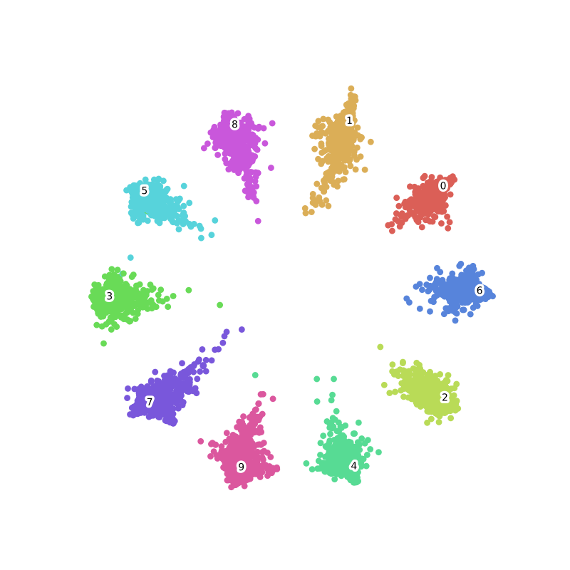
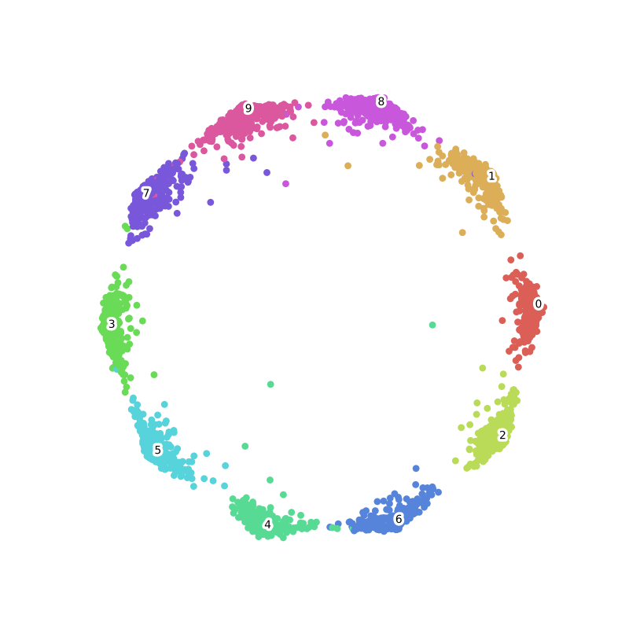
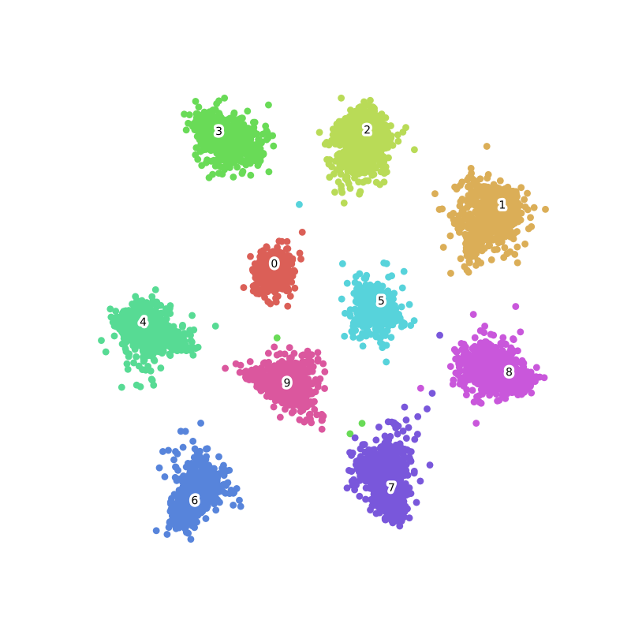

Gluon Face Toolkit
==================

Gluon Face is a toolkit based on MXnet Gluon, provides SOTA deep learning
algorithm and models in face recognition. If you are new to mxnet, please check out
`dmlc 60-minute crash course <http://gluon-crash-course.mxnet.io/>`__.

Gluon Face provides implement of losses in recent, including SoftmaxCrossEntropyLoss, ArcLoss,
TripletLoss, RingLoss, CosLoss, L2Softmax, ASoftmax, CenterLoss, ContrastiveLoss, ... ,
and we will keep updating in future. If there is any method we overlooked, please open an
`issue <https://github.com/THUFutureLab/gluon-face/issues>`__.

Losses in GluonFR:
------------------

The last column of this chart is the best LFW accuracy reported in
paper, they are trained with different data and networks, later we will
give our results of these method with same train data and network.

+---------------------+-------------------------------------------------------------------------------------------------------+--------------------------+--------------+
| Method              | Paper                                                                                                 | Visualization of MNIST   | LFW          |
+=====================+=======================================================================================================+==========================+==============+
| Contrastive Loss    | `ContrastiveLoss <http://yann.lecun.com/exdb/publis/pdf/hadsell-chopra-lecun-06.pdf>`__               |    -                     | -            |
+---------------------+-------------------------------------------------------------------------------------------------------+--------------------------+--------------+
| Triplet             | `1503.03832 <https://arxiv.org/abs/1503.03832>`__                                                     |    -                     | 99.63±0.09   |
+---------------------+-------------------------------------------------------------------------------------------------------+--------------------------+--------------+
| Center Loss         | `CenterLoss <https://ydwen.github.io/papers/WenECCV16.pdf>`__                                         |    |img2|                | 99.28        |
+---------------------+-------------------------------------------------------------------------------------------------------+--------------------------+--------------+
| L2-Softmax          | `1703.09507 <https://arxiv.org/abs/1703.09507>`__                                                     |    -                     | 99.33        |
+---------------------+-------------------------------------------------------------------------------------------------------+--------------------------+--------------+
| A-Softmax           | `1704.08063 <https://arxiv.org/abs/1704.08063>`__                                                     |    -                     | 99.42        |
+---------------------+-------------------------------------------------------------------------------------------------------+--------------------------+--------------+
| CosLoss/AMSoftmax   | `1801.05599 <https://arxiv.org/abs/1801.05599>`__/`1801.05599 <https://arxiv.org/abs/1801.05599>`__   |    |img3|                | 99.17        |
+---------------------+-------------------------------------------------------------------------------------------------------+--------------------------+--------------+
| Arcloss             | `1801.07698 <https://arxiv.org/abs/1801.07698>`__                                                     |    |img4|                | 99.82        |
+---------------------+-------------------------------------------------------------------------------------------------------+--------------------------+--------------+
| Ring loss           | `1803.00130 <https://arxiv.org/abs/1803.00130>`__                                                     |    |img5|                | 99.52        |
+---------------------+-------------------------------------------------------------------------------------------------------+--------------------------+--------------+
| LGM Loss            | `1803.02988 <https://arxiv.org/abs/1803.02988>`__                                                     |    |img6|                | 99.20±0.03   |
+---------------------+-------------------------------------------------------------------------------------------------------+--------------------------+--------------+

.. |img3| image:: _static/losses/cosloss-train-epoch95.png
.. |img4| image:: _static/losses/arcloss-train-epoch100.png

Authors
-------

{ `haoxintong <https://github.com/haoxintong>`__
`Yangxv <https://github.com/PistonY>`__
}

Discussion
----------

`中文社区Gluon-Forum <https://discuss.gluon.ai/t/topic/9959>`__ Feel
free to use English here :D.

References
----------

1. MXNet Documentation and Tutorials
   https://zh.diveintodeeplearning.org/

2. NVIDIA DALI documentation\ `NVIDIA DALI
   documentation <https://docs.nvidia.com/deeplearning/sdk/dali-developer-guide/docs/index.html>`__

3. Deepinsight
   `insightface <https://github.com/deepinsight/insightface>`__

.. toctree::
    :hidden:

    Home <self>
    install
    datasets
    model_zoo
    api/index
